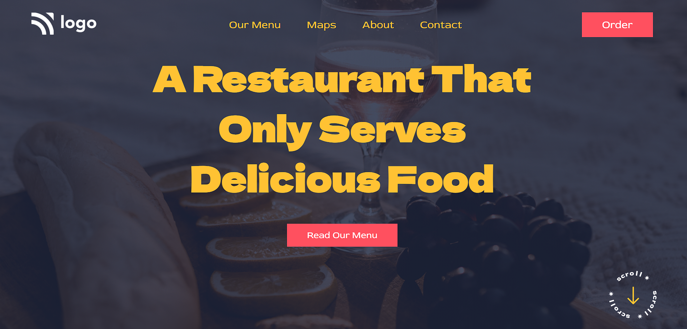

# Restaurant Web Page

> ## [Mansi Gupta](hthttps://twitter.com/butwhymansi)

 

## Tech Stack:

### _Live Hosted Link 🚀_ : _[Restaurant Landing Page](https://restaurant-lp-p2.netlify.app/)_

## How the website looks like:

## My Learnings

-   Skills Gained in this project
    -   Learned to use svg as background image.
    -   Learned to use colour gradient property. 

---